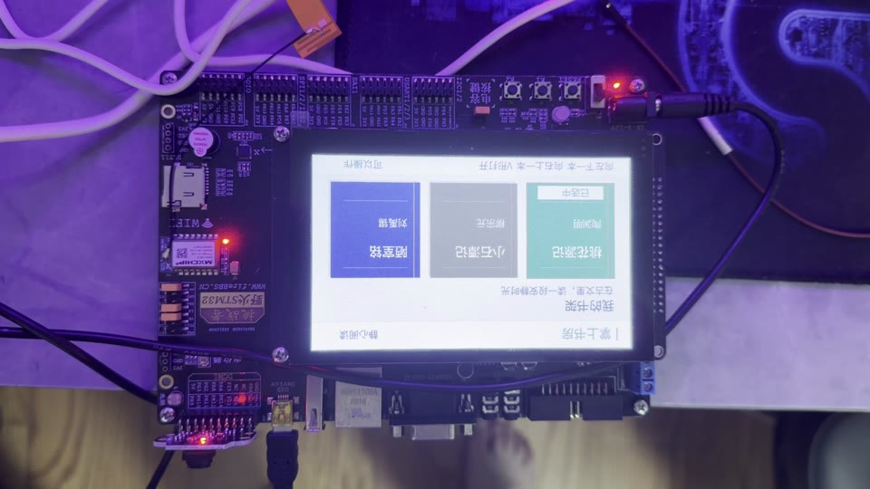
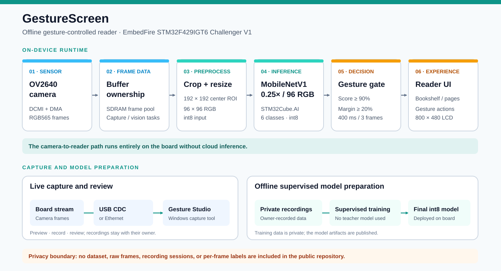

# GestureScreen

**An offline gesture-controlled reader on STM32F429, with a Windows capture and review tool.**

GestureScreen combines an OV2640 camera, an 800 × 480 RGB display, an on-device six-class gesture model, a small classical-text reader, and Gesture Studio for USB/Ethernet frame capture. The firmware source, CubeMX and Keil projects, model artifacts, verification tools, and final firmware are available here. The [Windows executable is in Releases](https://github.com/Geruyang/GestureScreen/releases).

[简体中文说明](README.zh-CN.md) · [Downloads](https://github.com/Geruyang/GestureScreen/releases) · [Privacy](PRIVACY.md) · [Third-party licenses](THIRD_PARTY.md)

## Demo video and architecture

[Play the complete demo in your browser](https://geruyang.github.io/GestureScreen/) · [Download the 1080p video from v1.0.0](https://github.com/Geruyang/GestureScreen/releases/download/v1.0.0/GestureScreen-demo-HQ.mp4)

## What it does

| Gesture | Reader action |
| --- | --- |
| Point left | Next book, article, or page |
| Point right | Previous book, article, or page |
| V sign | Open the selection |
| Open palm | Go up one level |
| Fist | Return to the bookshelf |

The bookshelf highlights the selection; the table of contents uses a dark selection with white text. The display shows reader content, not the camera feed. The sample library contains three public-domain classical Chinese works across 15 text pages.

The model classes are `POINT_LEFT`, `POINT_RIGHT`, `FIST`, `PALM`, `V_SIGN`, and `UNKNOWN`. The application uses a 90% score threshold, 20% margin, 400 ms hold, and three frames for actions. `UNKNOWN` at 95% for 600 ms and four frames is a neutral reset; it is not a physical hand-withdrawal detector.

## Hardware and software

- **Board:** EmbedFire/野火 STM32F429IGT6 Challenger V1. This is not the ALIENTEK Apollo board.
- **Peripherals:** OV2640, 800 × 480 RGB display, 8 MiB SDRAM, 16 MiB W25Q128 flash; HSE 25 MHz and 168 MHz system clock.
- **Capture:** native USB CDC on the board's J38 connector by default. The Ethernet/lwIP path remains in source and can be selected in `BSP/Inc/gs_capture_config.h`.
- **Firmware tools:** STM32CubeMX 6.18.1 with STM32CubeF4 1.28.3, Keil MDK 5.43 / Arm Compiler 6.24. Local installation and licenses are required; the vendor IDEs are not included.
- **Studio:** Windows 11 x64 was tested. Windows 10 x64 is a support target, but was not tested on a physical Windows 10 machine.

## Download and run

1. Download `GestureStudio.exe` from [the latest release](https://github.com/Geruyang/GestureScreen/releases). It is a self-contained Windows executable; no Python installation is needed for normal use. Verify its SHA-256 against the release notes.
2. If you have the specified Challenger V1 hardware, use `firmware/GestureScreen.hex`. Verify your board revision, connections, and target identity before programming it. The matching `.axf` and `.map` are included for debugging this exact image.
3. Connect the board's native USB port. Do not confuse its CDC port with the fireDAP debug probe's virtual COM port. Gesture Studio creates an empty `captures` directory next to the executable on first run. Observing does not save images; recording does.
4. Save a session to history to keep it. Normal close or a new session clears temporary recordings, while saved history remains. Exports are uncleaned recordings and are **not** training-ready data.

For source use, install the dependencies in `HostTools/requirements-studio.txt` with Python 3.12, then run `python HostTools/studio_client.py`. `python HostTools/capture_server.py --list-usb` lists ports without opening one. See [HostTools](HostTools/README.md) for the development workflow.

Before using GestureScreen, it's recommended to use a collection tool to create private training/validation/test sets for the user, then retrain and deploy MobileNetV1 with the user's data — this will give better results.

## Source map

| Path | Purpose |
| --- | --- |
| `GestureScreen.ioc`, `MDK-ARM/GestureScreen.uvprojx` | Sole CubeMX configuration and Keil target |
| `App/`, `Modules/`, `BSP/` | Reader behavior, gesture decisions, capture, board integration |
| `Core/`, `Drivers/`, `Middlewares/`, `USB_DEVICE/` | Generated and vendor-supplied firmware dependencies |
| `Assets/content/` | Public-domain sample text and provenance |
| `HostTools/` | Gesture Studio, browser UI, USB/HTTP capture, bundled model and licenses |
| `Models/`, `checkpoints/` | Final model evaluation and its training checkpoint |
| `firmware/` | The final HEX and matching debug artifacts |
| `Tools/`, `Tests/` | Build, integration, host verification, and debug helpers |

Build from the repository root with `./Tools/build.ps1 -UV4 <path-to-UV4.exe>` after installing the licensed toolchain. A CubeMX regeneration also needs `python Tools/integrate.py` afterward. The 121 file paths referenced by the Keil project were checked in this public source tree. This repository began as a final delivery snapshot; the first public commit does not contain the private development history. See [DEPENDENCIES.md](DEPENDENCIES.md), [THIRD_PARTY.md](THIRD_PARTY.md), and [tool/test guidance](Tools/README.md).

## Model and verification status

The final deployed model is a six-class MobileNetV1 0.25 × 96 RGB model trained with supervised labels only. On the owner's private, source-isolated images, the **frozen deployed int8 TFLite model** scored **293/361 (81.16%)** on validation and **294/350 (84.00%)** on test. These are top-1 classifications before gesture score, hold-time, and page-action gates, measured offline with the bundled RGB565 preprocessing and LiteRT reference interpreter. The 2,671-image dataset is withheld for privacy; see the [evaluation protocol](Models/README.md).

Some images have small or ambiguous gestures, which may depress the dataset scores relative to some everyday scenes.

The final firmware was programmed and passed a limited on-board health window. In 72 complete on-board inference records for this firmware, a single model inference took **153–182 ms wall time** (median **158 ms**, 95th percentile **176 ms**); preprocessing took another **25–40 ms**.

| Artifact | SHA-256 |
| --- | --- |
| `firmware/GestureScreen.hex` | `2a654ebc9243906abf8466266a79af1c5233e05d978654d0dcfa2ae3cbb9327f` |
| `firmware/GestureScreen.axf` | `bdc9ccc2e146f41243b00b66cd271dcfcfee46b42df33dae48a80693c1fc35bc` |
| `HostTools/model/gesture_v12_int8.tflite` | `9cc300884c79aed938dba492c7e5b536a1ab064b5f59c14d40c3628b7b7e4f4f` |
| `checkpoints/final-96rgb-best.pt` | `72db45f37036530652ef07e19ad20e6ce94552027d0fc81a9987c074f6c5c4be` |

The Studio release executable's SHA-256 is `37b710f9588a1a96ff9d27ff65e353177b31f50aa582852c6e4f49a8574bea56`.

## Privacy, license, and contributions

The gesture dataset was **recorded by the project owner** and includes personal imagery. No dataset, raw capture, session, or test image is published. The model artifacts are supplied without that data; see [PRIVACY.md](PRIVACY.md).

The owner's original work is MIT licensed. Bundled ST, Arm, FreeRTOS, lwIP, Qt, font, and other third-party components retain their own terms; see [THIRD_PARTY.md](THIRD_PARTY.md). Issues and pull requests are welcome under [CONTRIBUTING.md](CONTRIBUTING.md). If this project helps your STM32 camera or gesture UI work, a Star helps others find it.
